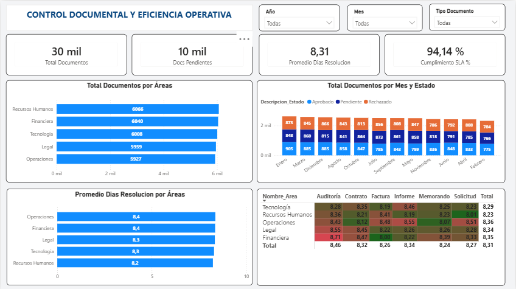

# Dashboard de Control Documental y Eficiencia Operativa (SLA)

<!-- IMAGEN DEL DASHBOARD -->
<p align="center">
  
</p>

## 📄 1. Caso de Negocio y Planteamiento del Problema
La organización enfrentaba serios problemas de visibilidad en la gestión de sus flujos documentales internos (facturas, contratos, auditorías, informes, memorandos y solicitudes). La dirección general carecía de herramientas centralizadas y métricas claras para responder a tres preguntas críticas del negocio:

*   ¿Qué áreas absorben el mayor volumen de documentos del sistema?
*   ¿Cuál es el tiempo promedio de resolución de trámites por departamento?
*   ¿Qué tipos de documentos específicos están bloqueando la operación?

**Objetivo del Proyecto:** Centralizar los movimientos de documentos, monitorear los acuerdos de nivel de servicio (SLA) mediante un modelo relacional de datos y detectar las desviaciones operativas para facilitar la toma de decisiones estratégicas. El universo de análisis consta de un set de datos histórico de **30,000 registros transaccionales** distribuidos entre departamentos clave de la empresa.

---

## 🛠️ 2. Estructura y Origen de Datos
Los datos se estructuraron bajo un enfoque de **Modelo en Estrella (Hechos y Dimensiones)** que simula la arquitectura relacional de un sistema de gestión empresarial real:

1.  **Tabla de Hechos Central:** `Movimientos_Documentos` (30,000 registros con IDs únicos, llaves foráneas y traza transaccional de marcas de tiempo).
2.  **Dimensión de Áreas:** `Dim_Areas` (Catálogo maestro de departamentos responsables: Legal, Financiera, Recursos Humanos, Operaciones, Tecnología).
3.  **Dimensión de Estados:** `Dim_Estados` (Catálogo maestro de la situación del trámite: Pendiente, Aprobado, Rechazado).
4.  **Dimensión de Tiempo:** `Dim_Tiempo` (Tabla de calendario para filtros cronológicos por Año, Mes y Día).

---

## 📈 3. Fase de Calidad de Datos, Limpieza y Auditoría (Excel)
Antes de realizar la importación al motor de Inteligencia de Negocios, se utilizó **Microsoft Excel** para ejecutar un control de calidad e inspección visual archivo por archivo:
*   **Estandarización Cronológica:** Las marcas de tiempo de las columnas de fechas se formatearon explícitamente como `Fecha Corta` para asegurar su compatibilidad y evitar errores al conectarse con la dimensión de tiempo.
*   **Tratamiento Avanzado de Valores Nulos:** Se auditó la columna `Fecha_Cierre` mediante filtros. Se comprobó que el estado *Pendiente* dejaba esta celda vacía de forma correcta. Se mantuvieron las celdas en blanco para preservar la integridad conceptual (un trámite activo no tiene fecha de finalización) y asegurar que el motor de Power BI las interpretara correctamente como elementos activos sin finalizar.
*   **Validación de Integridad Referencial:** Se ejecutó la función *Quitar Duplicados* en las columnas de IDs de las tablas de apoyo para garantizar la existencia de llaves primarias únicas y limpias.

---

## 🗂️ 4. Modelado de Datos y Arquitectura en Estrella (Power BI)
Los archivos validados se cargaron en Power BI Desktop. Las relaciones se configuraron estrictamente bajo el estándar de **Uno a Muchos (1:*)** con dirección de filtro único, garantizando que los filtros se propaguen de manera descendente desde las dimensiones hacia la tabla de hechos:
*   `Dim_Areas[ID_Area]` $\rightarrow$ `Movimientos_Documentos[ID_Area]` *(1:*)*
*   `Dim_Estados[ID_Estado]` $\rightarrow$ `Movimientos_Documentos[ID_Estado]` *(1:*)*
*   `Dim_Tiempo[Fecha]` $\rightarrow$ `Movimientos_Documentos[Fecha_Creacion]` *(1:*)*

---

## 🧪 5. Desarrollo Analítico y Fórmulas DAX
Para transformar los datos crudos en conocimiento de negocio, se implementaron soluciones analíticas basadas en **Data Analysis Expressions (DAX)**:

### Columnas Calculadas (Métricas Fila por Fila)
*   **Tiempo de Asignación (Horas):** Mide la velocidad del sistema para delegar una tarea.
    ```dax
    Horas_Asignacion = DATEDIFF(Movimientos_Documentos[Fecha_Creacion], Movimientos_Documentos[Fecha_Asignacion], HOUR)
    ```
*   **Tiempo de Resolución (Días):** Mide los días que le toma al gestor humano cerrar un caso desde que lo recibe.
    ```dax
    Dias_Resolucion = DATEDIFF(Movimientos_Documentos[Fecha_Asignacion], Movimientos_Documentos[Fecha_Cierre], DAY)
    ```

### Medidas Centralizadas (Cálculos Dinámicos Agregados)
*   **Volumen Absoluto de Gestión:** Cuenta el universo completo de solicitudes ingresadas.
    ```dax
    Total Documentos = COUNT(Movimientos_Documentos[ID_Documento])
    ```
*   **Volumen Activo de Casos:** Aisla aquellos registros bajo gestión activa (sin fecha de cierre).
    ```dax
    Docs Pendientes = CALCULATE([Total Documentos], Dim_Estados[Descripcion_Estado] = "Pendiente")
    ```
*   **KPI de Tiempo Promedio:** Calcula la media aritmética del tiempo que las áreas tardan en resolver.
    ```dax
    Promedio Dias Resolucion = AVERAGE(Movimientos_Documentos[Dias_Resolucion])
    ```
*   **Tasa de Cumplimiento de SLA (Eficiencia):** Evalúa la proporción de documentos finalizados dentro del marco límite institucional (menor o igual a 7 días):
    ```dax
    Cumplimiento SLA % = 
    DIVIDE(
        CALCULATE([Total Documentos], Movimientos_Documentos[Dias_Resolucion] <= 7),
        CALCULATE([Total Documentos], NOT(ISBLANK(Movimientos_Documentos[Fecha_Cierre]))),
        0
    )
    ```

---

## 📊 6. Resumen Ejecutivo y Hallazgos de Negocio

### 1. Diagnóstico de Carga Operativa Estable
La organización presenta una carga de trabajo sumamente equitativa y distribuida entre sus departamentos, acumulando un universo de **30,000 documentos gestionados**. No existe un monopolio operativo: el área con mayor volumen es **Recursos Humanos** (6,066 solicitudes), seguida muy de cerca por **Financiera** (6,040) y **Tecnología** (6,008). Esto demuestra que el flujo de entrada de trámites afecta a toda la estructura empresarial por igual.

### 2. Identificación del Cuello de Botella Operativo
El **Promedio General de Días de Resolución se sitúa en 8.31 días**. Al analizar el rendimiento por departamentos, **Operaciones** y **Financiera** lideran los retrasos con el promedio más alto de la empresa (**8.4 días**). Al cruzar las áreas con los tipos de documentos, la matriz enciende alarmas críticas en color rojo: el punto más crítico de toda la operación se localiza en el área **Financiera**, la cual tarda un promedio alarmante de **8.71 días** exclusivamente en procesar **Auditorías**, seguido por **Legal**, que de manera similar demora **8.55 días** en el mismo trámite.

### 3. Alerta Crítica de Trámites Activos
A pesar de que el **Cumplimiento de SLA es alto (94.14%)** (lo que indica que la gran mayoría de los documentos cerrados se resuelven a tiempo), el sistema enfrenta un riesgo latente de saturación. Actualmente existen **10,000 documentos atrapados en estado "Pendiente"** (un tercio del volumen total histórico). Al observar el histórico mensual, el volumen de documentos pendientes se mantiene plano y masivo todos los meses, promediando más de 800 casos activos por mes de manera sostenida (por ejemplo, 873 en Julio y 860 en Marzo). Esto exige una estrategia urgente de desatasco operativo.

### 4. Análisis de Estacionalidad Temporal
El flujo de ingresos del sistema documental muestra un comportamiento altamente estable y predecible a lo largo del año cronológico, manteniendo una media de **2,500 documentos procesados mensualmente** (con un pico máximo en Julio de 2,624 trámites y un suelo mínimo en Noviembre de 2,430). Sin embargo, al segmentar por tipología, se observa que los documentos de cumplimiento legal (como *Contratos* e *Informes*) representan un flujo constante mes a mes, mientras que las *Auditorías* y *Facturas* generan ligeros picos de saturación al cierre de cada trimestre (Marzo, Junio, Septiembre). Esta homogeneidad temporal facilita la planificación de la capacidad del personal gestor.

---

## 🎨 7. Interfaz y Visualización Profesional
El diseño del lienzo se configuró bajo una estructura de rejilla (*Grid Design*) con un fondo `#F3F4F6` para maximizar la legibilidad y el contraste entre secciones clave:
*   **Banner Superior y Filtros:** Incorpora el título institucional y menús desplegables para la selección dinámica de Año, Mes y Tipología de Documento, optimizando el espacio visual.
*   **Bloque Ejecutivo de KPIs (Fila 1):** Cuatro tarjetas numéricas de alto impacto alineadas horizontalmente que resumen la salud de la operación.
*   **Sección de Distribución de Volumen (Fila 2):** Un gráfico de barras horizontales para comparar la carga entre departamentos y un gráfico de columnas apiladas para auditar la tendencia mensual de documentos ingresados segmentados por colores según su estado.
*   **Sección de Diagnóstico Avanzado (Fila 3):** Un gráfico de rendimiento de días por área y una **Matriz de Alarma Operativa** configurada con un formato condicional de gradiente (Verde a Rojo) sobre el cruce de departamentos y tipos de documentos.
